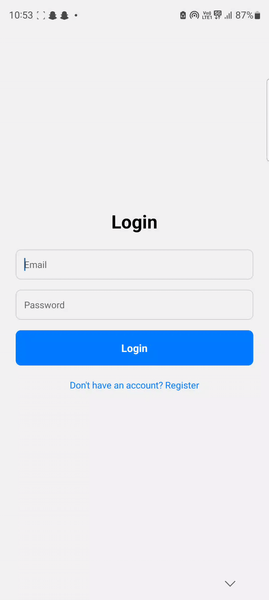

# FlashcardsApp

A full-stack Flashcards app built with React Native (frontend) and Node.js/Express/MongoDB (backend). Users can register, log in, and manage their own flashcards securely.

---

## Features
- User registration and login (JWT authentication)
▶️
- Create, view, update, and delete flashcards
▶️ [Watch the full demo video](assets/fc-crud.mp4)
- Mark cards as completed or important
▶️ [Watch the full demo video](assets/fc-quiz.mp4)

- Progress tracking
- Secure backend with MongoDB

---

## Project Structure

```
FlashcardsApp/
  ├── App.js                # Main React Native app entry
  ├── screens/              # App screens (Login, Register, Decks, etc.)
  ├── context/              # Context for deck state
  ├── components/           # UI components
  ├── utils/                # Utility files (API base URL)
  └── Backend/              # Backend server (Node.js/Express)
      ├── server/
      │   ├── index.js      # Express server entry
      │   ├── routes/       # Auth and flashcard routes
      │   ├── modals/       # Mongoose models
      │   └── middlewares/  # Auth middleware
      └── ...
```

---

## Getting Started

### 1. Clone the Repository
```sh
git clone https://github.com/yourusername/FlashcardsApp.git
cd FlashcardsApp
```

### 2. Backend Setup
```sh
cd Backend/server
npm install
```

#### Create a `.env` file in `Backend/server/`:
```
MONGODB_URI=your_mongodb_connection_string
JWT_SECRET=your_super_secret_key
```

#### Start the backend server:
```sh
node index.js
```

The backend will run on `http://<your-ip>:5000`.

---

### 3. Frontend Setup
```sh
cd ../../
npm install
npm install @react-native-async-storage/async-storage
```

#### Set your API base URL in `utils/api.js`:
```
export const API_BASE_URL = 'http://<your-ip>:5000';
```
Replace `<your-ip>` with your computer's local IP address.

#### Start the React Native app:
```sh
npx expo start
```

---

## Usage
- Register a new account or log in.
- Create and manage flashcards.
- Log out from the deck list screen.

---

## Troubleshooting
- **Network Error:** Ensure your backend is running and accessible from your device/emulator. Use your local IP, not `localhost`.
- **MongoDB:** Use MongoDB Atlas or a local MongoDB instance. Make sure your connection string is correct.
- **CORS:** The backend uses CORS by default.

---

## License
MIT 